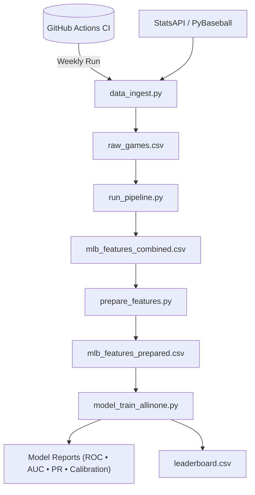
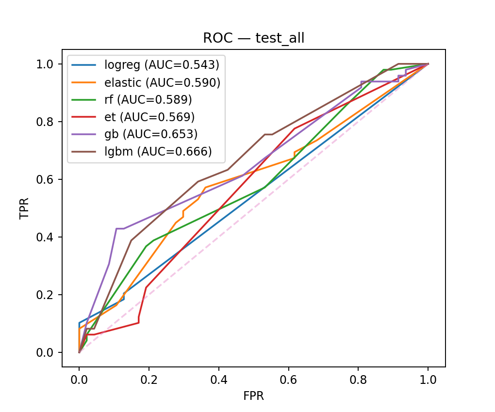

# 📈 MLB Predictive Analytics Pipeline  
### **Fully Automated · Incrementally Updated · Zero Data Leakage · Walk-Forward ML Training**

<p align="center">
  
  
  
  
</p>

---

## 🔧 **Project Overview**

This repository contains a fully automated **MLB game prediction and data engineering pipeline** that:

- Pulls live MLB data using **StatsAPI + PyBaseball**
- Incrementally ingests new games **without re-downloading old data**
- Builds feature tables with rolling stats, pitching data, weather, and team form
- Applies **anti-leak detection** to ensure strict prediction integrity  
- Produces a clean, deduplicated **combined dataset of all historical games**
- Runs advanced machine learning models with **walk-forward validation**
- Generates a full visual **model report** (ROC curves, PR curves, calibration, AUC trends)
- Deploys GitHub Actions to **train models weekly (March–October)**

This is a real MLOps-style project integrating engineering, modeling, and automation.

---

## 🚀 **Pipeline Features**

### 🔄 Data Engineering
- Fast ingestion of schedule, probables, and game metadata  
- Dedupe-by-`game_pk` to maintain a single source of truth  
- Rolling features (18–30 days) for batting/pitching/team form  
- Savant SP rolling metrics (optional)
- Park factors, weather fields, handedness, bullpen availability

### 🧼 Anti-Leak Protection
Automatically removes any feature related to:
- final scores  
- runs, decisions (W/L)  
- final win probability  
- post-game fields  
- moneyline odds (unless manually allowed)

This ensures **training exactly mimics pre-game prediction**.

### 🤖 Modeling
Evaluates a suite of ML models:
- Logistic Regression (L2)
- Elastic Net (logistic SAGA)
- Random Forest
- Extra Trees
- Gradient Boosting
- LightGBM (if installed)

Each model is:
- Calibrated (Platt or Isotonic)
- Threshold-optimized (F1 / Youden / Balanced)
- Evaluated on walk-forward CV

### 🖼 Output Reports (auto-generated)
- ROC curves (all models)
- Precision–Recall curves
- Reliability (calibration) plots
- Confusion matrix
- Walk-forward AUC timeline
- Leaderboard table
- Full JSON metadata summary

### 🧪 Validation
- Monthly walk-forward splits  
- Or progressive time-based splits  
- Strict chronological separation  
- No leakage of future information


## 📂 **Repository Structure**
```
mlb-pipeline/
│
├── 📁 scripts/
│ ├── 📄 data_ingest.py # Incremental ingest + dedupe
│ ├── 📄 run_pipeline.py # Orchestrator (ingest → combine → features → model)
│ ├── 📄 prepare_features.py # Cleaning & 150+ engineered features
│ └── 📄 model_train_allinone.py # Walk-forward training + ROC/PR/Calibration reports
│
├── 📁 out/ # Raw, combined, prepared datasets (auto-generated)
│
├── 📁 model_all_ts/ # Model reports, metrics, leaderboard, plots
│
├── 📁 docs/ # Architecture diagram, images, portfolio assets
│
├── ⚙️ .github/workflows/pipeline.yml # Weekly automated CI pipeline (GitHub Actions)
│
└── 📄 README.md


```

## 📊 Architecture Diagram


## ROC Curve (Test Set)


