# 📈 MLB Predictive Analytics Pipeline  
### **Fully Automated · Incrementally Updated · Zero Data Leakage · Walk-Forward ML Training**

<p align="center">
  
  
  
  
</p>

---

## 🔧 **Project Overview**

This repository contains a fully automated **MLB game prediction and data engineering pipeline** that:

- Pulls live MLB data using **StatsAPI + PyBaseball**
- Incrementally ingests new games **without re-downloading old data**
- Builds feature tables with rolling stats, pitching data, weather, and team form
- Applies **anti-leak detection** to ensure strict prediction integrity  
- Produces a clean, deduplicated **combined dataset of all historical games**
- Runs advanced machine learning models with **walk-forward validation**
- Generates a full visual **model report** (ROC curves, PR curves, calibration, AUC trends)
- Deploys GitHub Actions to **train models weekly (March–October)**

This is a real MLOps-style project integrating engineering, modeling, and automation.

---

## 🚀 **Pipeline Features**

### 🔄 Data Engineering
- Fast ingestion of schedule, probables, and game metadata  
- Dedupe-by-`game_pk` to maintain a single source of truth  
- Rolling features (18–30 days) for batting/pitching/team form  
- Savant SP rolling metrics (optional)
- Park factors, weather fields, handedness, bullpen availability

### 🧼 Anti-Leak Protection
Automatically removes any feature related to:
- final scores  
- runs, decisions (W/L)  
- final win probability  
- post-game fields  
- moneyline odds (unless manually allowed)

This ensures **training exactly mimics pre-game prediction**.

### 🤖 Modeling
Evaluates a suite of ML models:
- Logistic Regression (L2)
- Elastic Net (logistic SAGA)
- Random Forest
- Extra Trees
- Gradient Boosting
- LightGBM (if installed)

Each model is:
- Calibrated (Platt or Isotonic)
- Threshold-optimized (F1 / Youden / Balanced)
- Evaluated on walk-forward CV

### 🖼 Output Reports (auto-generated)
- ROC curves (all models)
- Precision–Recall curves
- Reliability (calibration) plots
- Confusion matrix
- Walk-forward AUC timeline
- Leaderboard table
- Full JSON metadata summary

### 🧪 Validation
- Monthly walk-forward splits  
- Or progressive time-based splits  
- Strict chronological separation  
- No leakage of future information


## 📂 **Repository Structure**
```
mlb-pipeline/
│
├── 📁 scripts/
│ ├── 📄 data_ingest.py # Incremental ingest + dedupe
│ ├── 📄 run_pipeline.py # Orchestrator (ingest → combine → features → model)
│ ├── 📄 prepare_features.py # Cleaning & 150+ engineered features
│ └── 📄 model_train_allinone.py # Walk-forward training + ROC/PR/Calibration reports
│
├── 📁 out/ # Raw, combined, prepared datasets (auto-generated)
│
├── 📁 model_all_ts/ # Model reports, metrics, leaderboard, plots
│
├── 📁 docs/ # Architecture diagram, images, portfolio assets
│
├── ⚙️ .github/workflows/pipeline.yml # Weekly automated CI pipeline (GitHub Actions)
│
└── 📄 README.md


```

## 📊 Architecture Diagram

```mermaid
flowchart TD

    %% GitHub Actions Trigger
    X[(GitHub Actions CI)] -->|Weekly Run| A[data_ingest.py]

    %% Data ingestion
    A --> B[raw_games.csv]

    %% Pipeline orchestrator
    B --> C[run_pipeline.py]

    %% Feature merging & building
    C --> D[mlb_features_combined.csv]
    D --> E[prepare_features.py]
    E --> F[mlb_features_prepared.csv]

    %% Model training
    F --> G[model_train_allinone.py]

    %% Outputs
    G --> H["Model Reports (ROC • AUC • PR • Calibration)"]
    G --> I[leaderboard.csv]

    %% Data source at the top
    S[StatsAPI / PyBaseball] --> A
```




## 📈 Model Performance (Latest Weekly Retrain)

The model is retrained automatically each week using a walk-forward time-series approach.  
Below are the most recent evaluation metrics generated by the CI pipeline.

### **ROC Curve — Test Set**


### **AUC Scores (per model)**
| Model              | Test AUC |
|-------------------|----------|
| **LightGBM**      | **0.666** |
| Gradient Boosting | 0.653 |
| Random Forest     | 0.589 |
| Elastic Net       | 0.590 |
| Logistic Regression | 0.543 |

### **Additional Evaluation Artifacts**
These files are also auto-generated weekly and available in `model_all_ts/figs/`:
- `confusion_best.png`
- `pr_test_all.png` (Precision-Recall curve)
- `reliability_best.png` (Calibration curve)
- `walkforward_auc.png` (AUC over time)

All metrics and plots are produced automatically during the GitHub Actions weekly retraining workflow.

